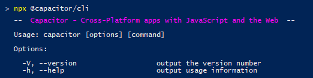

# Overview of the Capacitor CLI, @capacitor/cli

Most of the interactions you will have with [Capacitor](overview.md) will be through its Command Line Interface or CLI: `npx cap` (or `npx capacitor`).



This article describes how it works and lists all its commands and explains what they do:

- [npx?](#npx)
- [1. Create a Capacitor project](#1-create-a-capacitor-project)
  * [a) `npx cap init` or `npx cap init [appName] [appId]`](#a-npy-cap-init-or-npx-cap-init-appname-appid)
  * [b) `npx @capacitor/cli create` or `npx @capacitor/cli create [appDir] [appName] [appId]`](#b-npy-capacitorcli-create-or-npx-capacitorcli-create-appdir-appname-appid)
- [2. Add native platforms](#2-add-native-platforms)
  * [`npx cap add [platform]`](#npx-cap-add-platform)
- [3. Develop your app](#3-develop-your-app)
  * [`npx cap open [platform]`](#npx-cap-open-platform)
  * [`npx cap serve`](#npx-cap-serve)
- [4. Update your native Capacitor project(s)](#4-update-your-native-capacitor-projects)
  * [`npx cap copy [platform]`](#npx-cap-copy-platform)
  * [`npx cap update [platform]`](#npx-cap-update-platform)
  * [`npx cap sync [platform]`](#npx-cap-sync-platform)
- [5. Helpers](#5-helpers)
  * [`npx cap doctor [platform]`](#npx-cap-doctor-platform)
  * [`npx cap plugin:generate`](#npx-cap-plugingenerate)

---

## npx?

The `cap` in `npx cap` obviously stands for "Capacitor" and is an alias for `npx capacitor`, which would have been a bit too long to type in regularly.

But did you notice the `npx` in front of it? `npx` is a [relatively new "package runner"](http://blog.npmjs.org/post/162869356040/introducing-npx-an-npm-package-runner) from the team behind `npm` that allows you to run npm packages as CLI tools without globally installing them.

If you used Cordova or Ionic before, you know that the first step before being able to create a project with them is always to create a global installation of their CLI tool by running `npm install -g cordova` or `npm i -g ionic`. Then `cordova` or `ionic` becomes available globally in your command line.

`npx` on the other hand enables you to a) run a _local package_ from the project you are working on or b) run a _package that is not (yet) installed_ in your project or even _outside of a project context_ alltogether.

Besides being pretty handy, this also means that each Capacitor project can have its own version of the CLI locally installed in the project. Even if you upgrade one Capacitor project, you can easily still use an older version in another project.

The first two Capacitor commands use these options:

## 1. Create a Capacitor project

To [create your Capacitor project](https://capacitor.ionicframework.com/docs/getting-started/) you have two options:

### a) `npx cap init` or `npx cap init [appName] [appId]`

If you already have a web app with a `package.json` file, for example one built with Ionic, you start by installing the CLI and the Core library locally with `npm`:

    npm install @capacitor/cli @capacitor/core

Then you can use the `init` command from above to initialize a Capacitor configuration file, `capacitor.config.json`, in your existing project.

### b) `npx @capacitor/cli create` or `npx @capacitor/cli create [appDir] [appName] [appId]`

If you start without an existing web app project, you can use `npx` to temporarily download and install `@capacitor/cli` and use its `create` command to generate a whole Capacitor project with a rudimentary web app included (that has `@capacitor/core` installed).

## 2. Add native platforms

To actually start development of a native app you now have to add the platforms you want to support in your app to the project:

### `npx cap add [platform]`

Running `npx cap add ios` and `npx cap add android` will create an `ios` and `android` folder that contain ordinary native platform projects - with the native Capacitor libraries already installed.

It also runs `sync` - details on that [see below](#npx-cap-sync-platform) - to setup the native project.

## 3. Develop your app

There is not really a CLI command for that - you still have to do that manually 😄

But there are 2 commands that might make it easier for you:

### `npx cap open [platform]`

Opens the project in the native IDE for the chosen platform:

- Xcode for iOS
- Android Studio for Android.

You can of course also open in manually, but `open` will use the correct path by default and save you a few seconds.

### `npx cap serve`

If your web app doesn't have its own `serve` or `watch` workflow, Capacitor provides a minimal implementation that serves the current content of `www` to your default browser.

## 4. Update your native Capacitor project(s)

Now that you have your native projects (via `npx cap add`) there are two tasks that you have to use frequently and from time to time respectively:

### `npx cap copy [platform]`

Each time you create a new build of your web app in `www`, it has to be copied over to the native platforms to be included in the next native build of the app. `copy` takes care of that.

If you run your build via e.g. `npm run build`, it probably makes to add the `npx cap copy` command to the end automatically. For an Ionic project this might look like this:

```javascript
# package.json
{
  "scripts": {
    "build": "ionic-app-scripts build && npx cap copy",
  },
}
```

### `npx cap update [platform]`

If you also installed, updated or changed any native plugins (Capacitor or Cordova) via npm/`package.json` or updated Capacitor itself, you will have to use `update` to also apply those changes to the native projects. (Capacitor itself calls this ["Periodic Maintenance"](https://capacitor.ionicframework.com/docs/basics/workflow/#4-periodic-maintenance)).

The process copies over the plugin JS files and "installs" them into the native projects so they will automatically be picked up the next time the native app is built.

Beware: For iOS this process might take quite long as it does a lot of things with Cocoapods for the plugins, which is also why this is a separate command from `copy`.

### `npx cap sync [platform]`

This convenience command combines `copy` and `update` from above. Use it if you want to make sure all changes are synced to the native projects.

## 5. Helpers

There are also 2 more commands that might come in handy during development:

### `npx cap doctor [platform]`

This command checks the current project and setup for common errors.

### `npx cap plugin:generate`

Create a new Capacitor plugin from a minimal template.

---

And that's it!

As Capacitor doesn't abstract building and packaging your apps (read more about the [differences between Cordova and Capacitor](differences-between-capacitor-and-cordova.md)), these are all the commands that exist and are needed.
