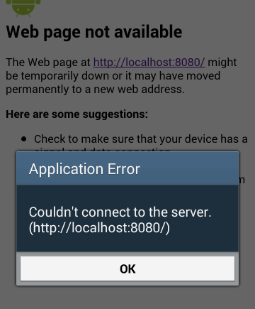

# Why current Ionic apps don't work with Android 4.x any more - and suggested solutions

You are on this page because you have problems with your Ionic app on Android 4.x (probably Android 4.4, KitKat) and are getting this error:

{:style="float:right"}

> **Application Error**  
> Couldn’t connect to the server.  
> (http://localhost:8080/)  
> [ OK ]

## Problem
{: style="clear:right"}

Back in October 2017 [Ionic introduced `cordova-plugin-ionic-webview`](https://blog.ionicframework.com/wkwebview-for-all-a-new-webview-for-ionic/) to support WKWebView in iOS apps (instead of the traditional but deprecated UIWebView) and since then added it to new Ionic apps by default. Back then this only applied to iOS.

But [on July 23rd 2018](https://github.com/ionic-team/cordova-plugin-ionic-webview/releases/tag/v2.0.0) they released version 2.0 of the plugin, that also included changes to the webview used on Android. The Android webview now uses a local webserver at `localhost:8080` to show your app instead of requesting the files directly from the file system.

Unfortunately this change also included this bit in the documentation:

> **Requirements**
> - [...]
> - Android: Android 5.0+ and cordova-android 6.4+

And that is the problem: `cordova-plugin-ionic-webview`, which is part of any newly created or updated Ionic app, just doesn't support Android earlier than 5.0 any more, which of course means your app will not work on Android 4.x.

## Solutions

1. **Get the problem heard**

   Before you do anything else, check the open [Pull Requests of `cordova-plugin-ionic-webview`](https://github.com/ionic-team/cordova-plugin-ionic-webview/pulls) and thumbs-up any PR that adds support for older Android versions like [e.g. this one](https://github.com/ionic-team/cordova-plugin-ionic-webview/pull/144). You might also want to [create an issue](https://github.com/ionic-team/cordova-plugin-ionic-webview/issues) or vote and comment on existing issues about the problem.

1. **Find out if you can avoid supporting Android 4.x devices**

   Android 4.4 (KitKat) was released in October 31, 2013 and its continued use makes Android apps much harder to develop and support. Check the [general market numbers](http://mobiledraft.com/numbers/) and especially usage numbers of _your own apps_ already in the Play Console if you might be able to drop support for Android 4.x. That would solve the problem.

1. **Downgrade the webview**
{: #downgrade}

   `cordova-plugin-ionic-webview` used to work on Android 4.x just fine. So one option is to downgrade the plugin in your app to the last version that supported Android 4.x:

   ```shell
   npm install cordova-plugin-ionic-webview@1.2.1
   ```

    Please note that of course you are then not getting any of the new features of `cordova-plugin-ionic-webview@2.x`, which includes any bug fixes or performance improvements (see a [list of changes in 2.x](https://github.com/ionic-team/cordova-plugin-ionic-webview/blob/master/CHANGELOG.md))

    Be also away that if you are using [Ionic Native's Ionic Webview](https://beta.ionicframework.com/docs/native/ionic-webview) wrapper, you have to uninstall it as it only works with `cordova-plugin-ionic-webview` >= 2.x as well.

1. **Use a different webview altogether**

   If you are not comfortable with using `cordova-plugin-ionic-webview@1.2.1`, you might look into using another webview. Although I strongly do not recommend that, here are some options:

   - https://github.com/apache/cordova-plugin-wkwebview-engine
   - https://ionicframework.com/docs/wkwebview/#downgrading-to-uiwebview
