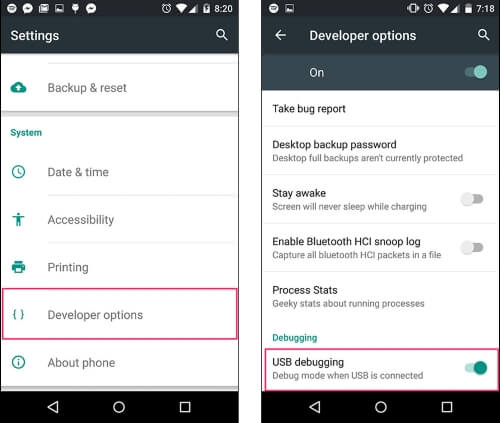
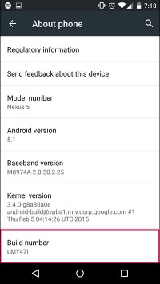
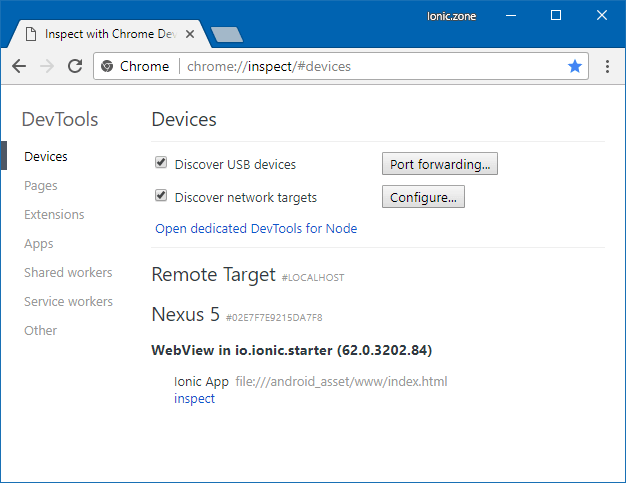
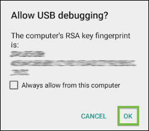
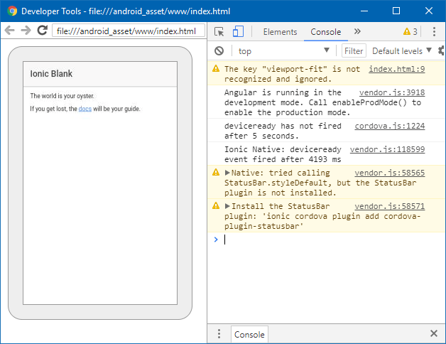
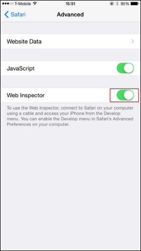
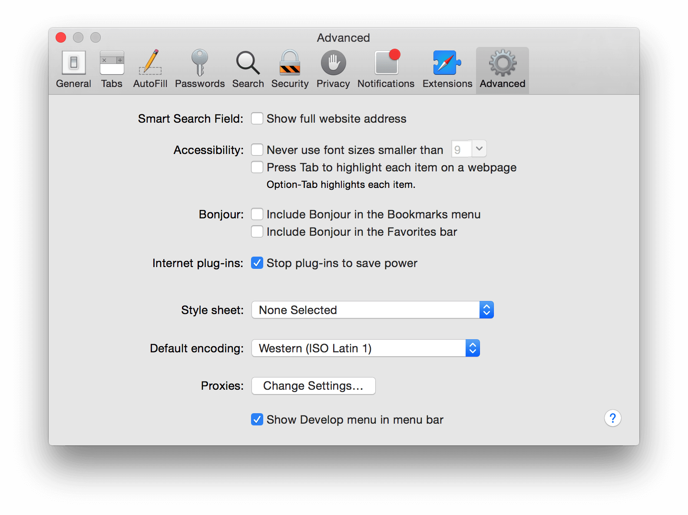
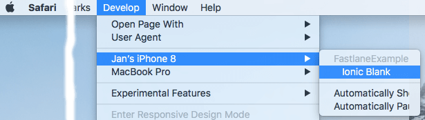
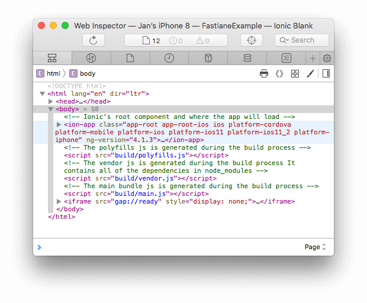

# Remote Debugging Ionic apps
{:.no_toc}

When you use `ionic serve` to run your application in the browser, your browser's DevTools can be used to debug your app. You can:

- View console logs
- Show history and details of Network requests
- Inspect elements, HTML, JavaScript or CSS
- Inspect Storage, Cache, Manifest or Service Workers
- Profile your app for Performance or Memory problems

When testing a [Debug build](TODO) of your app on _emulators, simulators or real devices_ with `ionic cordova run ios|android` or similar (like `ionic cordova emulate` or after distributing a test version built with `ionic cordova build` via a [third party beta distribution service](http://mobiledraft.com/tools/app-distribution/)), your app is not running directly in a browser any more. It is executed in the WebView of Cordova.

Fortunately, you can set up development devices for remote debugging with your desktop browser to use the debugging functionality as well.

Note: You can not debug apps running in [Ionic View](TODO) or the [Ionic DevApp](TODO). As these apps are downloaded from the stores they are built in [production/distribution](TODO) mode where debugging is disabled. You have to specifically build a Debug build of your app for debugging.
{:.message}

* toc
{:toc}

## Android

### Android Remote Debugging with Chrome

[Remote Debugging for Android](https://developers.google.com/web/tools/chrome-devtools/remote-debugging/) happens with the [Chrome DevTools](https://developers.google.com/web/tools/chrome-devtools) you are already familiar with from usage on desktop. It can be used with a _physical Android device_ or _Android emulator_.

Chrome of course works on all platforms like Windows, macOS or Ubuntu Linux.

#### Preparation

- Windows only: Install the necessary [USB drivers](https://developer.android.com/studio/run/oem-usb.html).
- Ubuntu Linux only: Install the [`android-tools-adb` package with `apt-get`](https://developer.android.com/studio/run/device.html#setting-up)
- Connect your physical device with a USB cable.
- Install [Chrome for Android](https://play.google.com/store/apps/details?id=com.android.chrome) on your device or emulator if is not already present.
- [Enable developer options and debugging](https://developer.android.com/studio/debug/dev-options.html#enable) on your device or emulator:  
`Settings > Developer Options > Enable USB Debugging`  
{:style="margin-top:20px"}
  - If this option is missing, first activate developer options:  
  `Settings > System (Android 8+ only) > About phone > Tap Build number 7 times`.  
  {:style="margin-top:20px"}

#### Debugging

Now Chrome on your desktop machine should discover your device and the WebView inside your app:

- Open [chrome://inspect](chrome://inspect) (or via `⠇> More tools > Remote devices` in a running DevTool instance)
- The Devices list should contain your device with the WebView of your app:  
{:style="margin-top:20px"}
- The first time you execute this process with a combination of mobile device and desktop computer, you will have to accept a "Allow USB Debugging" prompt on your device.  
{:style="margin-top:20px"}

If your device and app do not appear, read these more elaborate [instructions on Remote Debugging for Android](https://developers.google.com/web/tools/chrome-devtools/remote-debugging/) from Google that also offer several problem resolution steps.
{:.message}

By clicking "inspect" next to your WebView you can now open the DevTools for your app and use all its usual functionality. You will also see a "Screencast" of your app next to the DevTools panels for navigating your app and selecting elements.



Your first stops will probably be the "Console" and "Network" tabs to look for warnings or errors that can tell you why your app is not looking or behaving like it should.

{::comment}
TODO check if true and where to place above
First off, we will need to have [adb](http://developer.android.com/tools/help/adb.html) installed. Once installed, if your device is connected, or an Android emulator is running, you should be able to see your device listed when you run the following command:

```
$ adb devices
```
{:/comment}

## iOS

### iOS Remote Debugging with Safari (macOS only)

macOS offers [Safari Web Inspector](https://developer.apple.com/safari/tools/) as the tool to remote debug iOS apps on _physical iOS devices_ but also _simulators_. You use the [Safari Develop menu](https://support.apple.com/guide/safari/use-the-safari-develop-menu-sfri20948/mac) to find your app and start the debugging session.

Safari is unfortunately only available for macOS and can not be installed on Windows or Ubuntu Linux. {::comment}TODO Check below for other options to remote debug iOS apps that also work on non-macOS platforms.{:/comment}

#### Preparation

- Navigate to `Settings › Safari › Advanced` on your iOS device and enable the Web Inspector.  
{:style="margin-top:20px"}
- Navigate to `Preferences › Advanced` in Safari on your Mac. Check "Show Develop menu in menu bar" option at the bottom.  
{:style="margin-top:20px"}
- Connect your physical iOS device to your Mac
  - Connect your physical device with a USB cable.
  - Since macOS 10.12.4+, Xcode 9+ and iOS 11+ you [can connect to your device wirelessly](https://help.apple.com/xcode/mac/9.0/index.html?localePath=en.lproj#/devbc48d1bad).  
    Note that you [can not _deploy_ your app to the device wirelessly with Ionic or Cordova CLI yet](https://github.com/phonegap/ios-deploy/issues/320).
    - Connect your device with a USB cable.
    - Select "Connect via network" in your device settings in Xcode (`Window > Devices and Simulators > Devices`).
    - Unplug the USB cable, a "globe" icon next to your device name indicates that it is now connected wirelessly.
    - Install [Safari Technology Preview](https://developer.apple.com/safari/technology-preview/).
    - Continue with this guide, use Safari Technology Preview in place of Safari

#### Debugging

Now Safari on your Mac should be able to see your app running on your device:

- Navigate to the `Develop` menu in Safari, and select your device:
  {:style="margin-top:20px"}
- Click on your app running on the device that you want to debug.

It will open a Web Inspector window for your app, showing the usual developer tools functionality, hovering over elements in the "Elements" view will highlight them on the device.



Your first stops will probably be the "Console" and "Network" tabs to look for warnings or errors that can tell you why your app is not looking or behaving like it should.

{::comment}
TODO
### iOS Remote Debugging with Chrome via `ios-webkit-debug-proxy`

As Safari is only available for macOS you need another option if you want to remote debug your iOS app on a non-macOS computer. [`ios-webkit-debug-proxy`](https://github.com/google/ios-webkit-debug-proxy/) from Google works on all platforms where Chrome runs.

#### Preparation

#### Debugging

{:/comment}

{::comment}
TODO 
### iOS Remote Debugging light with jsconsole.com

Scroll down:
Remote Debugging iOS Safari on Windows and Linux:
https://blog.idrsolutions.com/2015/02/remote-debugging-ios-safari-on-os-x-windows-and-linux/
{:/comment}

{::comment}
TODO
## Remote Debugging - VS Code Plugin

VS Code has a dedicated plugin for debugging apps built with Cordova. The [plugin](https://marketplace.visualstudio.com/items?itemName=vsmobile.cordova-tools) creates bridge between the device and the debugger and allows you to set break points in your editor directly.
{:/comment}
